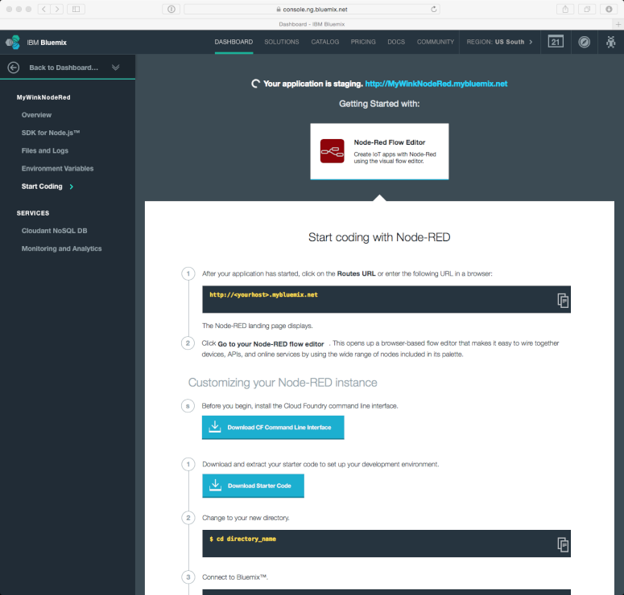
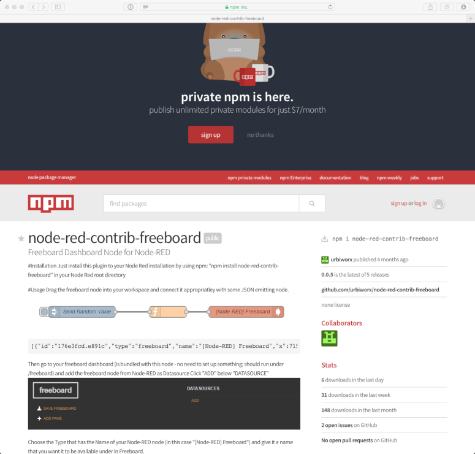
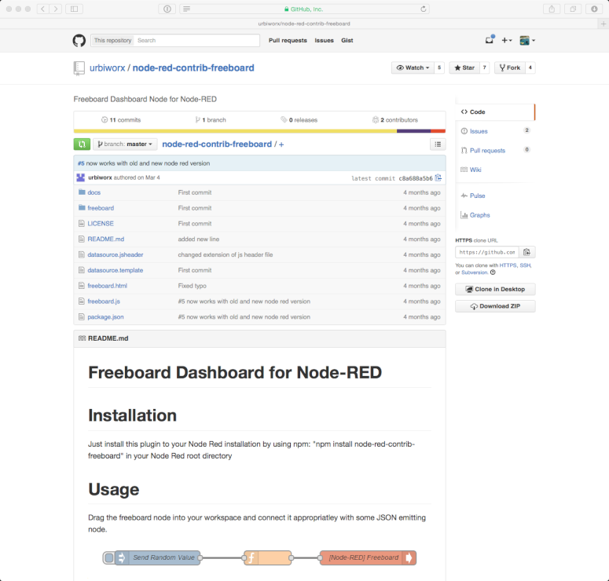
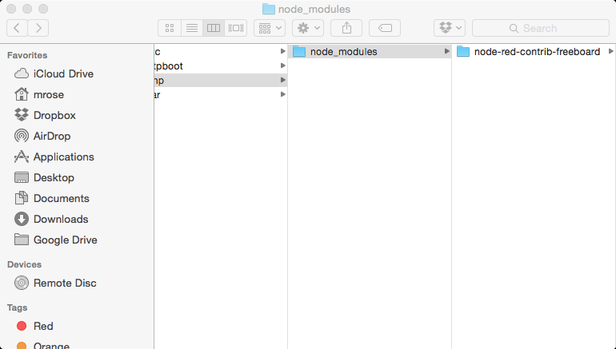
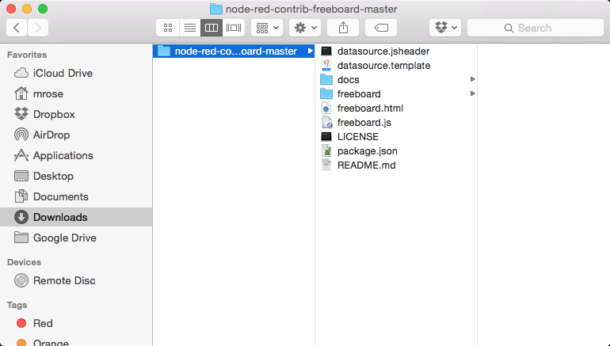
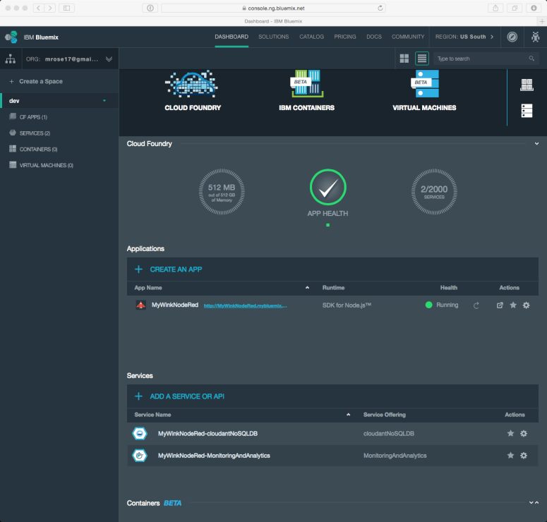
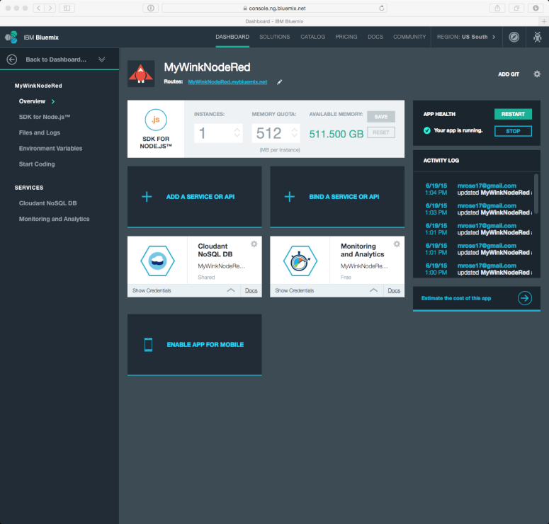
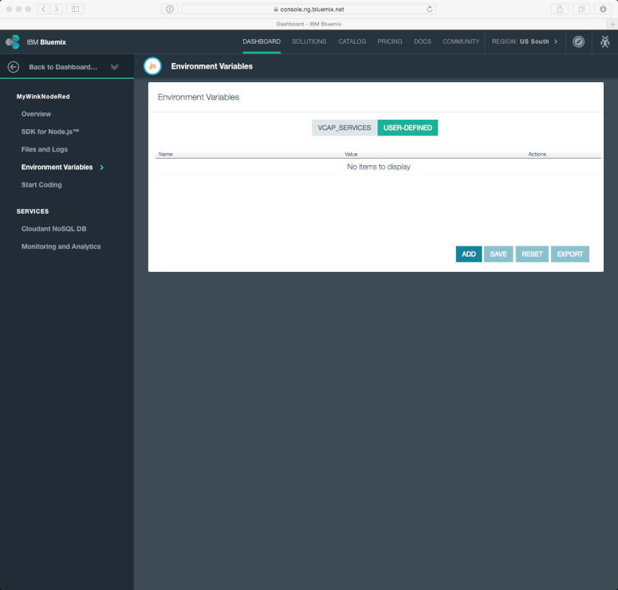
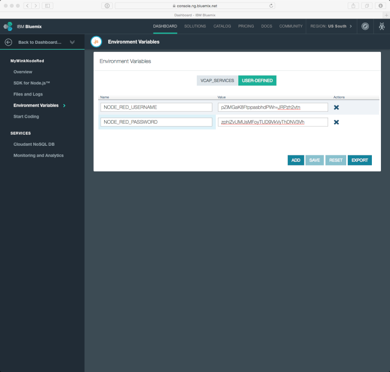
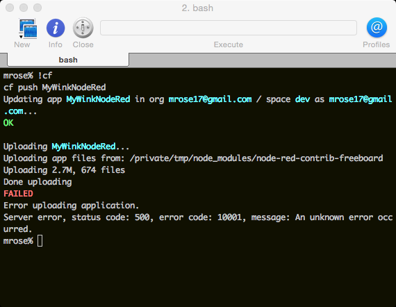

# How to create a cloud instance for Node-Red and Freeboard in the IBM Bluemix cloud

## Creating the MyWinkNodeRed Application

If you haven't already, please signup for a free **IBM Bluemix** account at [http://bluemix.net/](http://bluemix.net/)

Log in to your account, and make sure that you're on the "Dashboard"

Scroll down to "Applications" and click on "+ Create an App" and then click on "Web"

Click on "Browse Boilerplates" -- and when the pop-up appears, click on "Browse Boilerplates" in the pop-up

Click on "Node-RED Starter"

Enter the application "name" in the "Create an app" panel (e.g., "MyWinkNodeRed") --
the "host" will automatically be filled-in

Click on "Create" --
in approximately 30 seconds, the screen will change to "Your application is staging."

Wait about two minutes --
you'll see "Your app is running. [http://MyWinkNodeRed.mybluemix.net](http://MyWinkNodeRed.mybluemix.net)"

Click on the link to access your application

## Adding the Freeboard node module
To add an additional node package to your IBM Bluemix cloud instance,
the steps are:
* find the node package
* fetch the package
* set environment variables
* upload the package

## Configuring the Cloud Foundry environment
However, there's a *once-only* step to be performed --
installing and configuring your Cloud Foundry environment on your computer.

Go to [https://github.com/cloudfoundry/cli/releases](https://github.com/cloudfoundry/cli/releases)

Click on the link for the appropriate installer,
after it successfully downloads,
double-click on the installer program,
and then follow the steps.

### Finding the node package
To add the freeboard node module,
go to [http://flows.nodered.org/](http://flows.nodered.org/) and enter "freeboard" into the search window

Click on the "node-red-contrib-freeboard" box

### Fetching the package
Under "Installation",
you'll see

        npm install node-red-contrib-freeboard

That's the command you'll run on your computer -- this assumes that you have the `npm` command installed on your computer.
If so, great!
After running `npm`,
you'll see a folder called `node_modules` has been created,
and within it is the folder you want

If you want to install `npm` on your computer,
please read [this](http://blog.npmjs.org/post/85484771375/how-to-install-npm),
follow the steps and then run the `npm install` command above.

If you do not wish to use `npm` on your computer, you can fetch via _github_ --
notice that in the "Node Info" box, there is a link to [view on npm](https://npmjs.org/package/node-red-contrib-freeboard) --
click on that link

Click on the [https://github.com/urbiworx/node-red-contrib-freeboard](https://github.com/urbiworx/node-red-contrib-freeboard)
link in the right-hand column

Click on "Download ZIP" in the right-hand column -- this will create a folder called "node-red-contrib-freeboard-master"

### Setting the Environment Variables
Go to your IBM Bluemix dashboard

Click on the _rocketship_ icon for your application

Click on "Environment Variables" in the left-hand column, and then click on "User-Defined"

Add and save two environment variables,
`NODE_RED_USERNAME` and `NODE_RED_PASSWORD`,
these will be used to log into your Freeboard

### Uploading the Package
Open your command line program (`cmd` on Windows, `iTerm` on Mac OS X, etc.) and
change to the folder where the the freeboard node module was fetched,
and run `cf api https://api.ng.bluemix.net`

Then run `cf login -u your_ibm_bluemix_login_id`

When prompted, enter your IBM Bluemix password.
You'll be asked to select a workspace -- there should be only one, so select that.

Finally, run `cf push MyWinkNodeRed`

Go to [http://MyWinkNodeRed.mybluemix.net](http://MyWinkNodeRed.mybluemix.net) and click on "Go to your Node-RED flow editor"

You will be prompted to enter the `NODE_RED_USERNAME` and `NODE_RED_PASSWORD` values that you entered into `manifest.yml`

### Next Steps

 * Start importing flows or creating your own.
 * freeboard will be accessible via http://your_ibm_bluemix_application_name.mybluemix.net/freeboard
