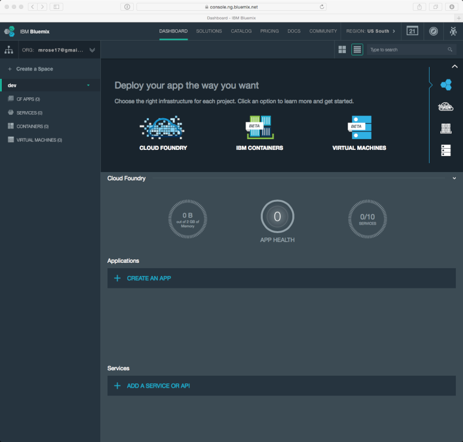
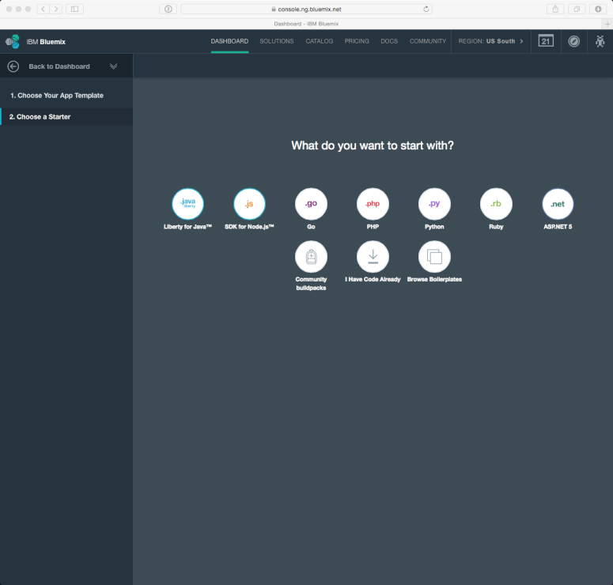
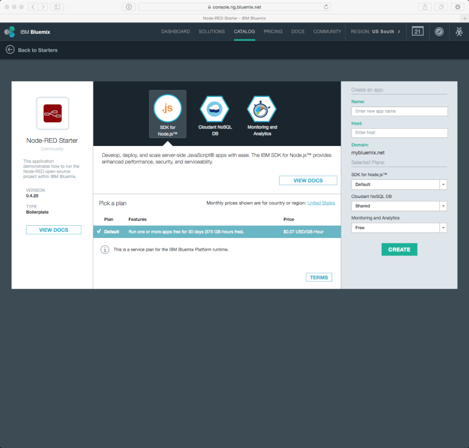
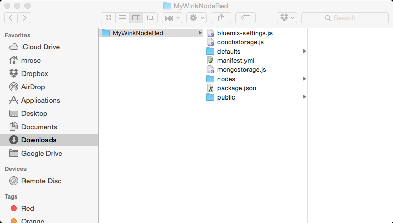
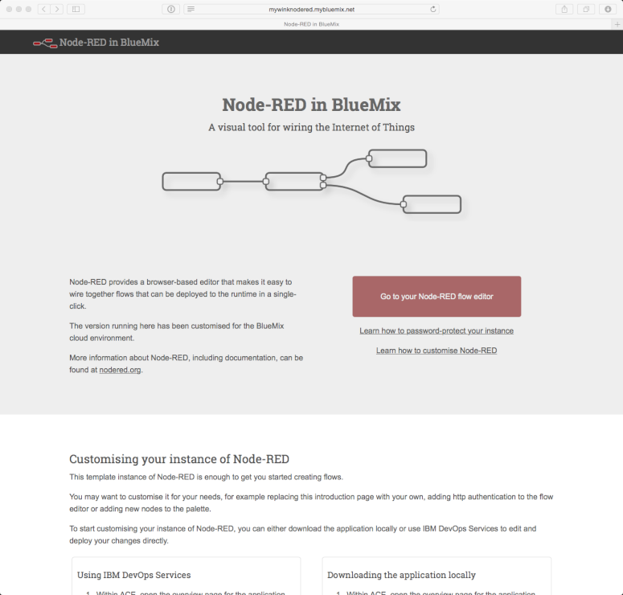
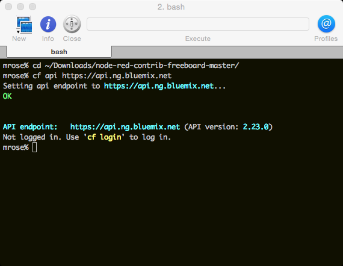
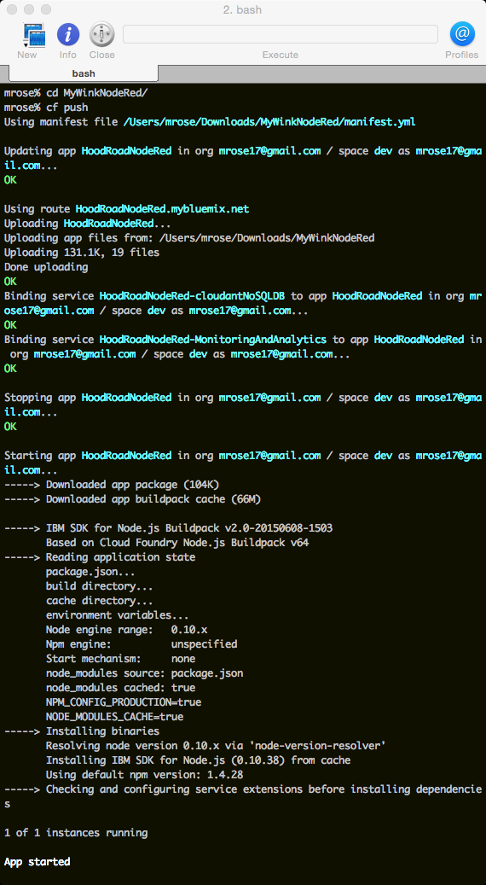

# How to create a cloud instance for Node-Red and Freeboard in the IBM Bluemix cloud

In the text that follows,
the string `MyWinkNodeRed` is used as the application name -- 
you are free to use a different name'
however, be sure to keep this in mind as you read the documentation!

## Creating the MyWinkNodeRed Application

If you haven't already, please signup for a free **IBM Bluemix** account at [http://bluemix.net/](http://bluemix.net/):

Log in to your account, and make sure that you're on the "Dashboard":

Scroll down to "Applications" and click on "+ Create an App" and then click on "Web":

Click on "Browse Boilerplates" -- and when the pop-up appears, click on "Browse Boilerplates" in the pop-up:

Click on "Node-RED Starter":

Enter the application "name" in the "Create an app" panel (e.g., "MyWinkNodeRed") --
the "host" will automatically be filled-in:

Click on "Create" --
in approximately 30 seconds, the screen will change to "Your application is staging.":

While you are waiting, scroll down and click on "Download Starter Code" --
this creates a folder named as your application:

Wait about two minutes --
you'll see "Your app is running. [http://MyWinkNodeRed.mybluemix.net](http://MyWinkNodeRed.mybluemix.net)" -- 
click on the link to access your application:

## Download and Configure the Cloud Foundry environment
Go to [https://github.com/cloudfoundry/cli/releases](https://github.com/cloudfoundry/cli/releases):

Click on the link for the appropriate installer,
after it successfully downloads,
double-click on the installer program,
and then follow the steps.

Open your command line program (`cmd` on Windows, `iTerm` on Mac OS X, `xterm` on Linux, etc.) and
and run the `cf api https://api.ng.bluemix.net` command:

Then run the 

        cf login -u your_ibm_bluemix_login_id

command,
and when prompted, enter your IBM Bluemix password.

## Configuring Your Application

### Editing three files
In the "MyWinkNodeRed" folder that was created,
there are three files to be edited.

* In `bluemix-settings.js`,
look for this line:

        functionGlobalContext: { },

    and replace it with these lines:

        functionGlobalContext: {
              WinkUser         : { uid : "your Wink username"
                                 , pwd : "your Wink password"
                                 }
            , BlueMixUrlBase   : "https://MyWinkNodeRed.mybluemix.net"
            , forecastIoApiKey : "your api key"
            , HomeLocation     : { "lon" : "the longitude of your home location"
                                 , "lat" : "the lattitude of your home location"
                                 }
        },

    to get an API key for `forecast.io` go [here](https://developer.forecast.io).

* In 'manifest.yml',
below the line:

          domain: mybluemix.net

    add these three lines:

          env:
            NODE_RED_USERNAME: pseudo-random-string-one
            NODE_RED_PASSWORD: pseudo-random-string-two

    e.g.,

          env:
            NODE_RED_USERNAME: zphiZvUMUsMFoyTUD9VkVyThDNV3Vh
            NODE_RED_PASSWORD: pZiMGaK8FtppasbhdPWr=JRPzh2vtn

    Note that indentation is important!

* In `package.json`,
below the line:

                "node-red-node-cf-cloudant":"0.x",

    add this line:

                "node-red-node-pushbullet":"0.x",

    Also, below the line:

        "node-red-contrib-bluemix-hdfs":"0.x",

    add this line:

        "node-red-contrib-freeboard":"0.x",

    When you're done the entire file should look something like:

        {
            "name"         : "node-red-bluemix",
            "version"      : "0.4.20",
            "dependencies": {
                "when": "~3.x",
                "mongodb": "~1.4.x",
                "nano": "~5.11.0",
                "cfenv":"~1.0.0",
                "feedparser":"~0.19.2",
                "redis":"~0.10.1",
                "node-red": "0.x",
                "node-red-bluemix-nodes":"0.x",
                "node-red-node-cf-cloudant":"0.x",
                "node-red-node-pushbullet":"0.x",
                "node-red-contrib-scx-ibmiotapp":"0.x",
                "node-red-contrib-ibmpush":"0.x",
                "node-red-contrib-bluemix-hdfs":"0.x",
                "node-red-contrib-freeboard":"0.x",
                "node-red-nodes-cf-sqldb-dashdb":"0.x"
            },
            "engines": {
                "node": "0.10.x"
            }
        }

### Updating the application
Open your command line program,
change to the folder where the the folder named for your application was crated,
and run the `cf push MyWinkNodeRed` command:

## Next Steps
Go to [http://MyWinkNodeRed.mybluemix.net](http://MyWinkNodeRed.mybluemix.net) and click on "Go to your Node-RED flow editor"

You will be prompted to enter the `NODE_RED_USERNAME` and `NODE_RED_PASSWORD` values that you entered into `manifest.yml`

 * Start importing flows or creating your own.
 * freeboard will be accessible via http://your_ibm_bluemix_application_name.mybluemix.net/freeboard
