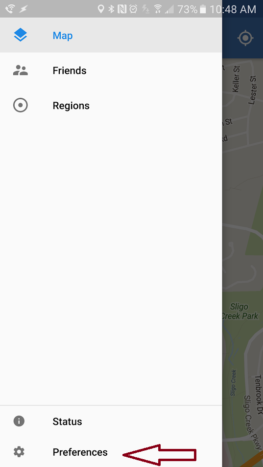
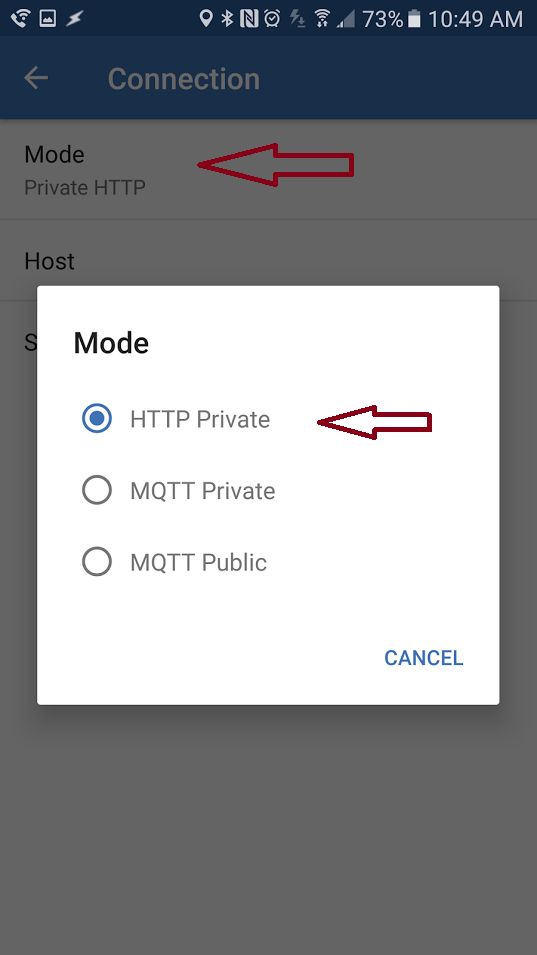
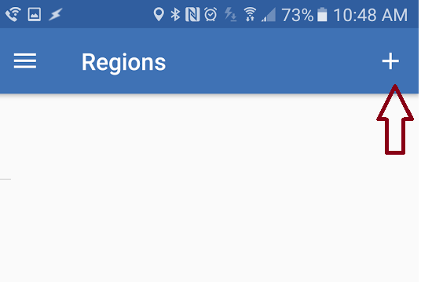
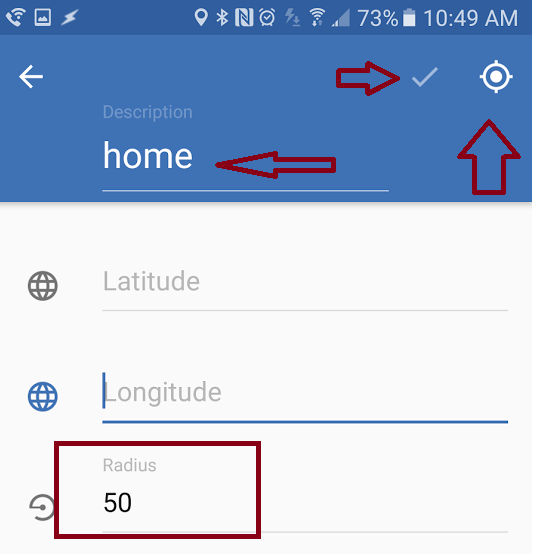

#owntrack configuration.
-
### Node red connection setup
 * open owntracks app, click on hamburger menu and select preferences

 * click on Connection, then Mode and select HTTP Private
 
 *  Click on Host and put following url: `https://your_app_name.mybluemix.net/loc/your_name/owntracks_secret_key`
  *  *your_name* is a sensor name you would like to see in Node red (case sensitive)
  * *owntracks_secret_key* is a code phrase you configured in winkNodeRed configuration tab 
 ######Click Accept.
-

### home region setup.
 * Open owntracks app  click on hamburger menu and select regions
 
 * click on + to add new region
 
 * In the Region screen - put name as home (all letters lower case), click on locate button if you are at home or populate gps coordiantes manually, then also select geofence radius in meters. And click "check" button to save it.
 
