# Honeywell Lyric API Wink Node Red
Access Honeywell Lyric API with node red
# Integrating Wink Node Red and Honeywell Lyric API
This will detail step by step how to gain access to the Honeywell Lyric API, create a Lyric App to access connected devices and integrate into Wink Node Red
## 1)Wink Node Red
#####Required steps (WNR)
*  Create new tab  - give it a meaningful name (Honeywell Lyric Integration)
*  Import from clipboard - [HoneyLyricFlow.json](HoneyLyricFlow.json)
*  Deploy flow
*  Import updated [winkCore.json](../Bluemix/winkCore.json)
*  Import updated [winkIntegration.json](../Bluemix/winkIntegration.json)
*  Import updated [tabletUI.json](../Bluemix/tabletUI.json)
*  do not forget to check [duplicate websockets](../../README-WebsocketFix.md)
*  perform "FULL" deployment 
###### Bluemix git console: 
Do to changes made to the freeboard code
*  re-deploy application in git  

## 2)Honeywell Developer Site
Here you will create an App that will allow access to your Honeywell Lyric devices through there API.

### 2.1)Create account
[Honeywell Developer](https://developer.honeywell.com/):
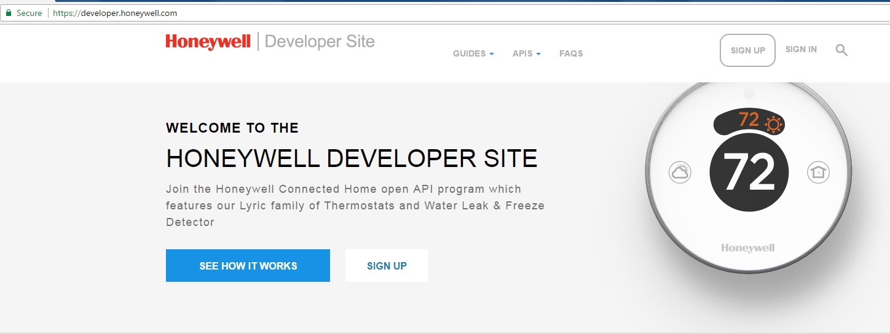

### 2.2)Create App
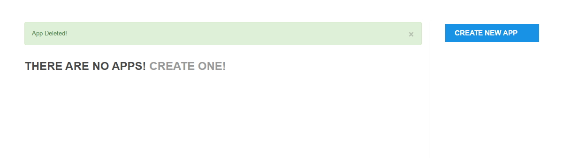

### 2.3)Name App
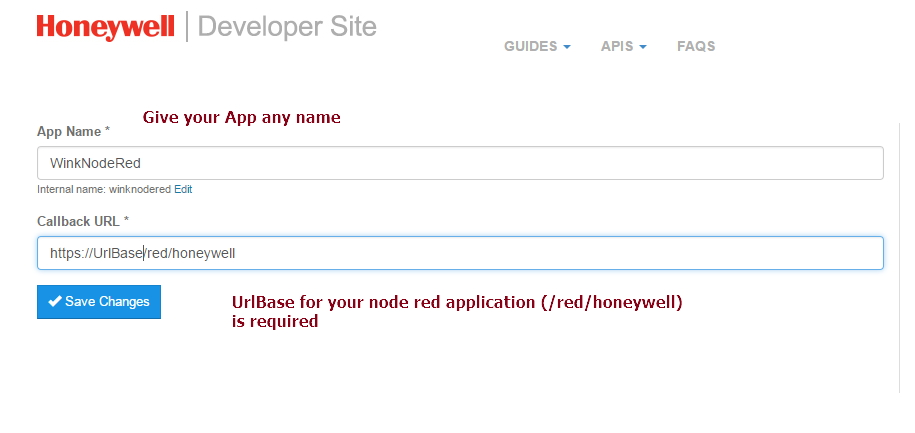

### 2.4)App created get Keys
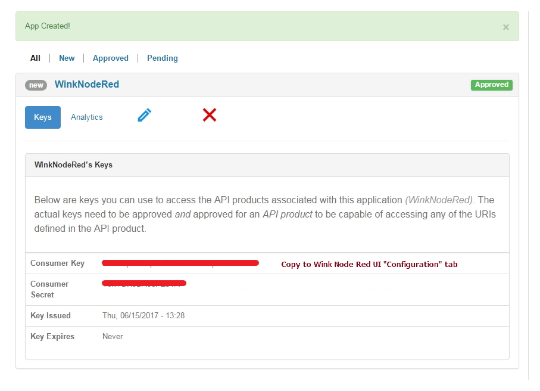

Copy keys to Wink Node Red Home Dashboard UI and then "submit" the changes

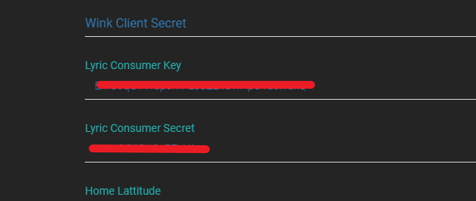

### 2.5)Authorization API
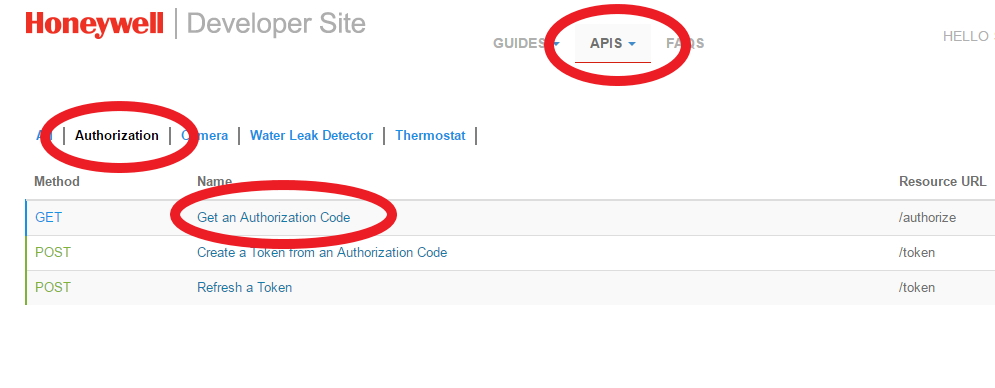

### 2.6)Request access code
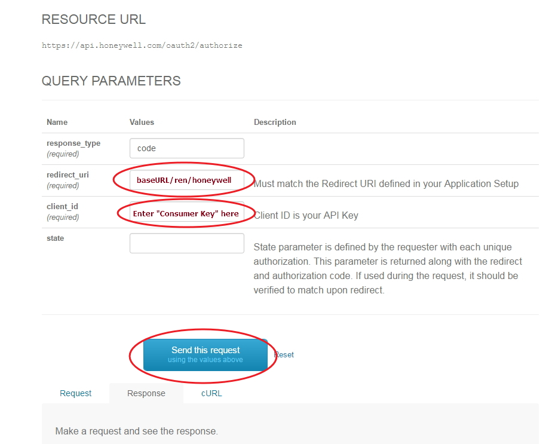

### 2.7)Responce from access code request
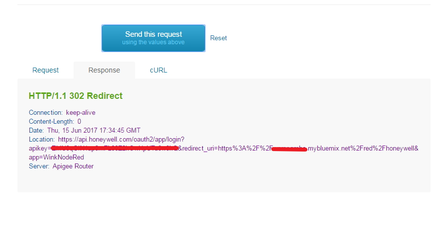

highlight the Responce Location: URL and goto the URL Link.  This will take you to the Lyric Authorization page.

### 2.8)Log On and Allow access
Log in with your Honeywell Lyric credentials (the ones for the Lyric App if different then the developer site)
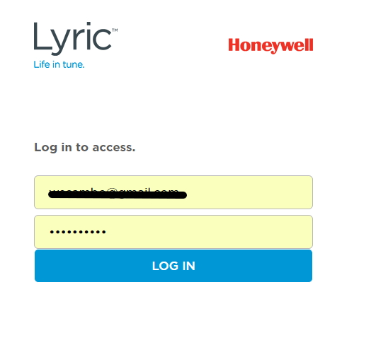
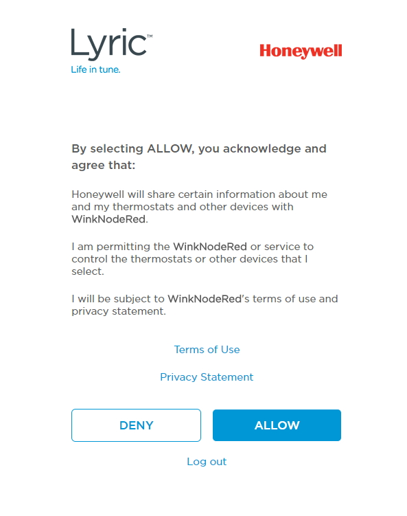

### 2.9)Select devices and Connect
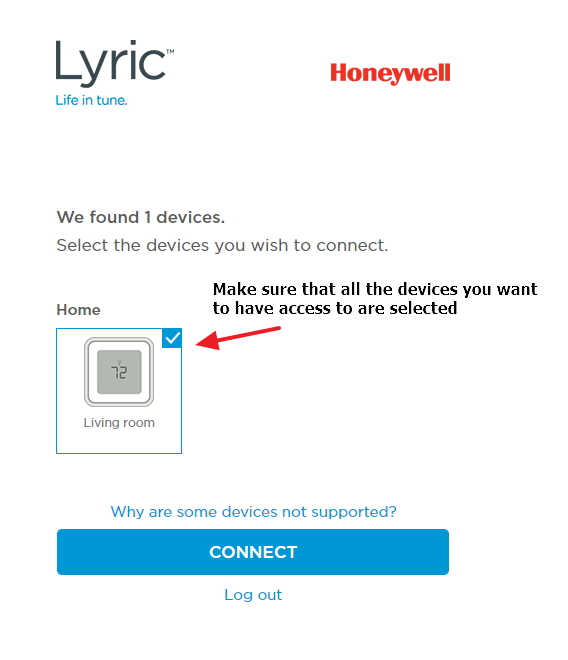

###  If all things went according to plan you should see in the your Node-RED debug console the "access_token and refresh_token"
