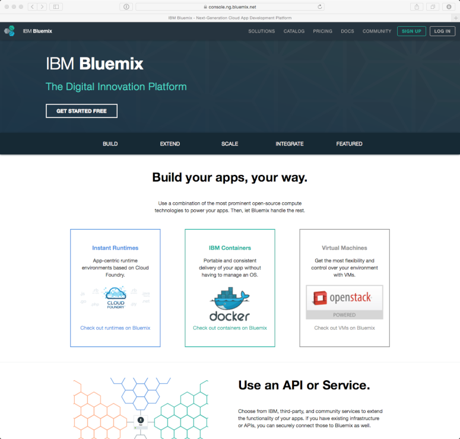
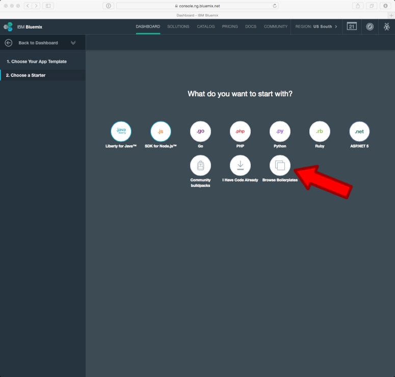
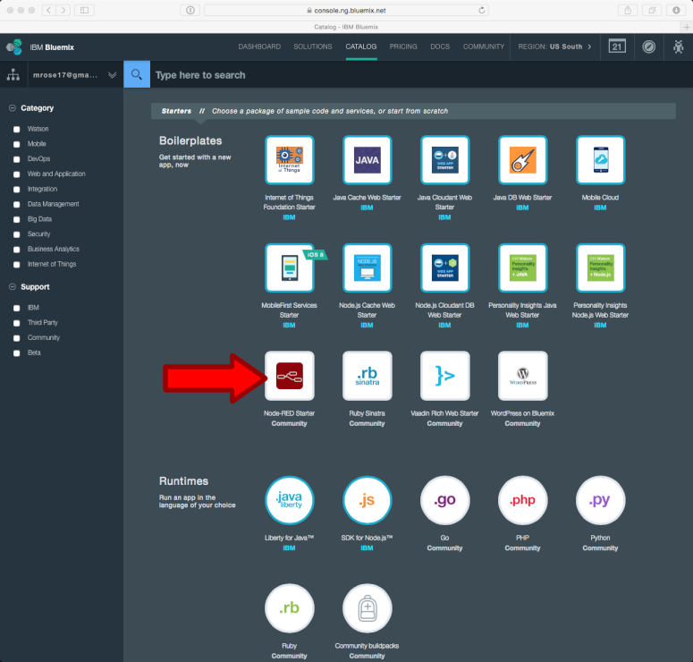
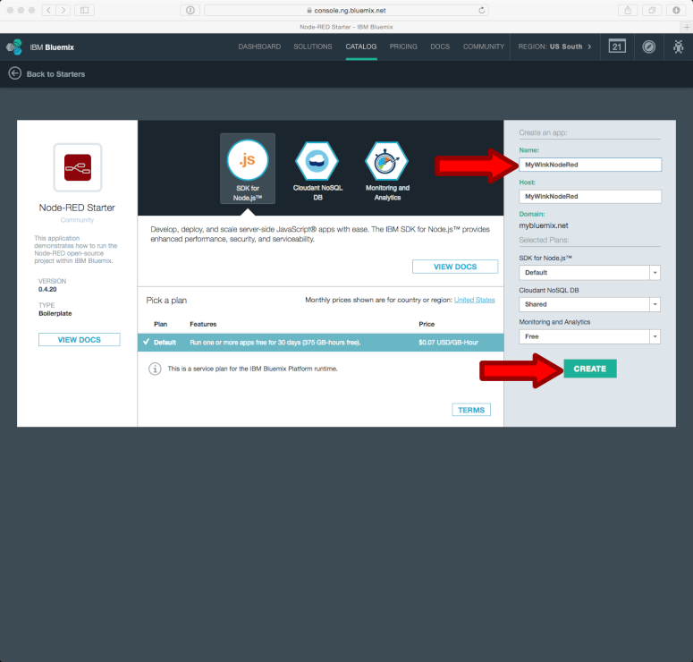

# How to create a cloud instance for Node-RED and Freeboard in the IBM Bluemix cloud

In the text that follows,
the string `MyWinkNodeRed` is used as the application name -- 
<b>you need to use a different name and change corresponding configuration lines with that name.</b> 
<b>Keep this in mind as you read the documentation!</b>

## Creating the MyWinkNodeRed Application

If you haven't already, please signup for a free **IBM Bluemix** account at [https://bluemix.net](https://bluemix.net/):

Log in to your account, and make sure that you're on the "Dashboard" --
Scroll down to "Applications" and click on "+ Create an App" and then click on "Web":

Click on "Browse Boilerplates" -- and when the pop-up appears, click on "Browse Boilerplates" in the pop-up:

Click on "Node-RED Starter" -- you may have to wait a while for the form in the right-hand column to finish loading:

Enter the application "name" in the "Create an app" panel (e.g., "MyWinkNodeRed".  <b>remember the name you created as you will use it later in the configuration</b>
the "host" will automatically be filled-in. Click on "Create":

In approximately 30 seconds, the screen will change to "Your application is staging.":

## Set up a Git Hub repository for your Node Red application
On the left hand side you will see your application's name, click "Overview" to be taken to your application's overview page. Click the link which says "Add Git" on the top right side of the browser window (above "App Health")

Follow the window through the prompts to create a Git Hub repository.

Once created, you'll be taken to the Git Hub repository which includes all of your files for the Wink Node Red application. Click "Edit Code" at the top right to be taken to the web-based file editor.

## Configuring Your Application
-----------------
In the "MyWinkNodeRed" git hub repository that was created, there are three files to be edited. Bluemix-settings.js, manifest.yml, and package.json. We'll walk you through editing each of the 3 files in the following steps. You'll make these changes using the web-based file editor in the Git Hub repository for your application. **Just like any file editor, when you're finished editing a file, click "File" and then "Save"**

#### bluemix-settings.js
In `bluemix-settings.js` delete all contents and copy everything from this file
 [https://github.com/tfatykhov/WinkRedNode/blob/master/Flows/Bluemix/bluemix-settings.js](https://github.com/tfatykhov/WinkRedNode/blob/master/Flows/Bluemix/bluemix-settings.js)
 * Find following line ` WinkUser: {"uid":"XXX","pwd":"XXXX"}` and relpace XXX with your actual wink app user id and password
 * Find following line  `,BlueMixUrlBase: "https://XXXX.mybluemix.net"` and replace XXX with your actuall application name that you created above. 

**Remember to use "File" -> "Save" so your changes are saved.**

#### manifest.yml
In 'manifest.yml', below the line:

          domain: mybluemix.net

add these three lines:

          env:
            NODE_RED_USERNAME: another-pseudo-random-string 
            NODE_RED_PASSWORD: and-another-pseudo-random-string

e.g.,

          env:
            NODE_RED_USERNAME: zphiZvUMUsMFoyTUD9VkVyThDNV3Vh
            NODE_RED_PASSWORD: pZiMGaK8FtppasbhdPWr=JRPzh2vtn

Keep in mind that what you enter for the username and password will be what you will use to log in to the Node Red application. Don't make it too complex, but don't make it too easy either -- your login page is visible to everyone on the internet! If your username/password combo is too easy then anyone can gain access to your Node Red application. 

<b>Note that indentation is important!</b> 
* you can use following file as a sample:
[https://github.com/tfatykhov/WinkRedNode/blob/master/Flows/Bluemix/manifest.yaml](https://github.com/tfatykhov/WinkRedNode/blob/master/Flows/Bluemix/manifest.yaml)
 
When you're done the entire file should look something like: ((remember to change <b>xxx</b> part to the app name you selected during BlueMix configuration))

        applications:
        - path: .        
          memory: 512M   
          instances: 1          
          domain: mybluemix.net          
          name: xxx          
          host: xxx          
          disk_quota: 1024M          
          services:
          - xxx-cloudantNoSQLDB
          - xxx-MonitoringAndAnalytics
          env:
            NODE_RED_USERNAME: pseudo-random-string-one
            NODE_RED_PASSWORD: pseudo-random-string-two
          command: node --max-old-space-size=384 node_modules/node-red/red.js --settings ./bluemix-settings.js -v            

**Remember to use "File" -> "Save" so your changes are saved.**

#### package.json
 In `package.json`, delete all of the text in the file, then copy and paste the text from this link into your package.json file.
* [https://github.com/tfatykhov/WinkRedNode/blob/master/Flows/Bluemix/package.json](https://github.com/tfatykhov/WinkRedNode/blob/master/Flows/Bluemix/package.json)

**Remember to use "File" -> "Save" so your changes are saved.**

**_All changes mentioned above are essential for app to function properly_**

### Updating the application after editing the files
Once you're done editing the three files above, click the icon on the left hand side which resembles an upside down Rachio icon, you can see it highlighted in white on the below photo.

When you're in the commit section, you'll see all the changes on the right pane. Click "Select all" and then put some text into the box at the top to describe your changes. "Initial setup" for example. Click "Commit" in the top right (cut off in this picture) and you'll see the changes on the left pane show up ready to be synced. Click "Sync" at the top.

At the top right of the page, click `Build & Deploy` and you'll see your changes being built and then deployed to your Node Red application. If your changes were done correctly you'll see Success. If there's any issues, you can click to view the logs and that should give you hints as to what was done wrong.

If you run into problems and are stuck, you can get support through the following two methods:
* **(Preferred)** [https://www.facebook.com/groups/WinkNodeRed/](https://www.facebook.com/groups/WinkNodeRed/) - Reach out to us on Facebook at our Wink Node Red facebook group.
* [https://github.com/tfatykhov/WinkRedNode/issues](https://github.com/tfatykhov/WinkRedNode/issues) - Create a new issue on the Wink Node Red project git hub.

## Fundamental Flows for Node-RED on Bluemix
Go to [https://MyWinkNodeRed.mybluemix.net](https://MyWinkNodeRed.mybluemix.net) (change MyWinkNodeRed to your application name) and click on ["Go to your Node-RED flow editor"](https://mywinknodered.mybluemix.net/red).

You will be prompted to enter the `NODE_RED_USERNAME` and `NODE_RED_PASSWORD` values that you previously entered into `manifest.yml`.

Navigate to [https://github.com/tfatykhov/WinkRedNode/blob/master/README-ImportingUpdating%20Flows.md](https://github.com/tfatykhov/WinkRedNode/blob/master/README-ImportingUpdating%20Flows.md) and follow the directions for importing the main flows into Wink Node Red.

To start using Freeboard,
go to [https://mywinknodered.mybluemix.net/freeboard](https://mywinknodered.mybluemix.net/freeboard/),
and take a look at [README-Freeboard.md](README-Freeboard.md).

To start using IFTTT,
take a look at [README-IFTTT.md](README-IFTTT.md).

