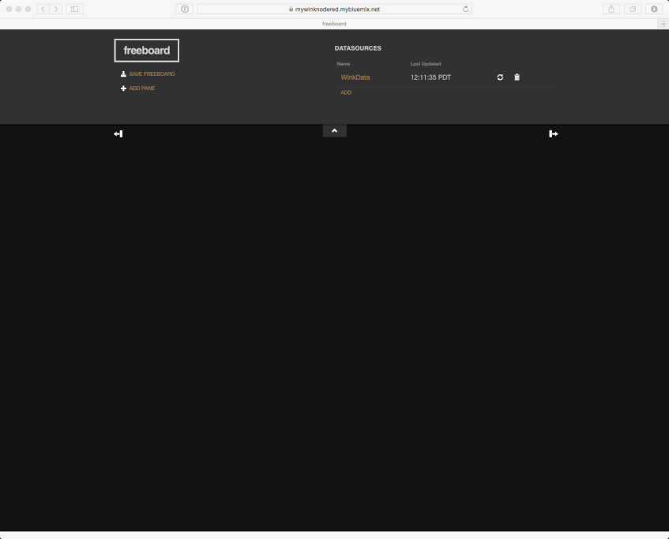
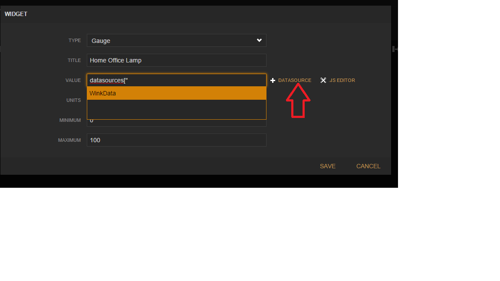
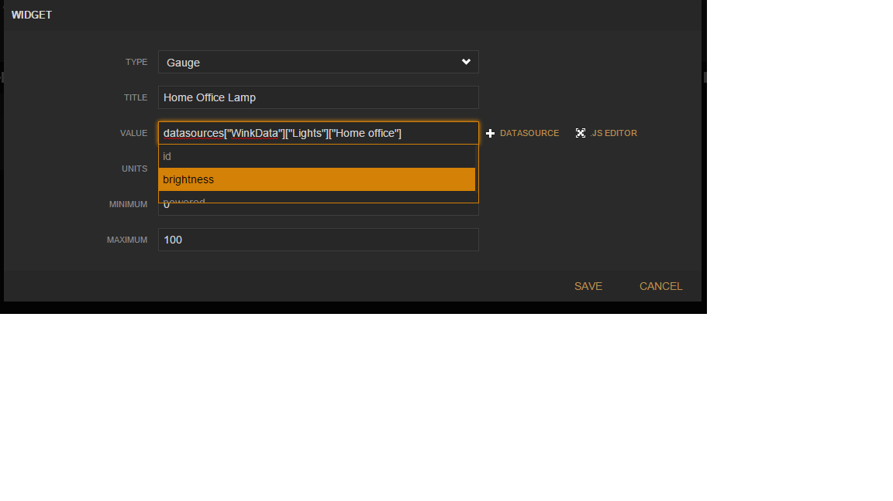

# How to use Freeboard with Node-Red

First,
determine where Freeboard "lives" -- for example,
if you deployed Node-Red and Freeboard in the IBM Bluemix cloud,
then go to [https://mywinknodered.mybluemix.net/freeboard/](https://mywinknodered.mybluemix.net/freeboard/)

Freeboard is configured by 

* adding one or more "DataSources";

* adding one or more panes; and,

* for each pane, adding one or more widgets.

# An Example
Let's create a pane with a gauge widget that monitors the brightness of a light.

Click on "Add" under "DataSources",
select the "JSON" type,
enter "WinkData" as the "Name",
enter [https://mywinknodered.mybluemix.net/red/getGlobalDataJson](https://mywinknodered.mybluemix.net/red/getGlobalDataJson)
as the "URL":

Click "Save":

Here's how to create a gauge that shows the current brightness setting of a smart bulb.

Click on "Add Pane" and in the pane, click on "+":

Select "Gauge", enter a name for the gauge, click "+ DataSource", and then click on "WinkData":

Click on "Lights"

Click on "brightness", and then append "*100"
(In Wink,
brightness is a percentage from `0.0` to `1.0` -- since humans prefer to think of percentages from `0` to `100`,
we'll multiple Wink's value by 100):

Enter "%" for "Units":

Click on "Save":

Finally, click on "Save Freeboard".
Now bookmark the browser location, e.g.,

        https://mywinknodered.mybluemix.net/freeboard/#start-...

that's where the new Freeboard lives.

sample dashboard video - https://www.youtube.com/watch?v=gE8lXdsOkNI
