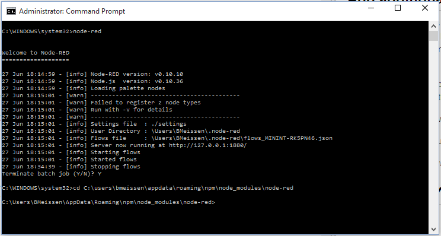
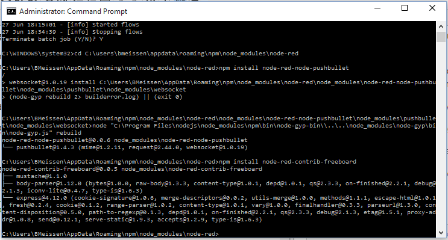

# How to set up Node Red and Freeboard on Windows

While NodeRed.org contains a basic setup, this tutorial will make installation and setup easier.

[A high-level install tutorial can be found on NodeRed.org's website.](http://nodered.org/docs/getting-started/installation.html)

## Download and Install node.js
To ensure you're installing the latest version, [refer to Node Red's installation tutorial](http://nodered.org/docs/getting-started/installation.html) for the proper 32-bit or 64-bit installation link.

Download the latest version of Node.js from the installation tutorial above and run the installation. You can leave the default settings.

## Install Node Red via Command prompt

Now that Node.js is installed, you can use the Node Package Manager (npm) command to install Node Red from the command prompt.

From the Run menu, type Command. When Command prompt shows in the results, right click and select "Run as Administrator"

When the command prompt opens, use the following command to install Node Red:

    npm install -g node-red

You'll see warning messages scroll past having to do with python -- don't worry, it will not affect your install. When the installation completes, you should see something similar to the screenshot below with various modules that are installed by default.

To run Node Red, simply type `node-red` into your command prompt window. Take note of the data displayed, specifically the `User Directory`, and `Server now running at http://127.0.0.1:1880/` -- to access the Node Red editor, browse to [http://127.0.0.1:1880/](http://127.0.0.1:1880/) 

> Note: To stop Node Red, use `Control+C` in the command window. Type `Y` to confirm.

> 

## Add additional nodes to your installation

Additional Node Modules can be added to your default installation to add more functionality. We will walk you through installing Pushbullet and Freeboard, but [additional modules can be found on Node Red's website](http://flows.nodered.org/). Noteworthy modules which you can install on your own include nodes for interacting with Wemo devices, Hue devices, and Nest thermostats.

Return to the command prompt window where you used the `node-red` command. As noted earlier, use `Control+C` to terminate the batch job, then `Y` to confirm termination.

  

From the same window, use the change directory command (`cd`) and browse to your Node Red directory:
>C:\users\\(Your Windows username)\AppData\Roaming\npm\node_modules\node-red\

From this directory, use the following two commands to install Pushbullet and Freeboard to your Node Red application.

    npm install node-red-node-pushbullet
	npm install node-red-contrib-freeboard

If installed successfully, your window should look similar:

After issuing the `node-red` command to start Node Red up again, you should see two Push Bullet nodes under the Social category:

To access your Freeboard module, browse to [http://localhost:1880/freeboard](http://localhost:1880/freeboard)

Next we will make changes to the configuration to secure your Node Red application and also set up some necessary variables for our sample flows to work!

## Configuring Your Application

### Editing three files
In the "MyWinkNodeRed" folder that was created,
there are three files to be edited.

* In `bluemix-settings.js`,
look for this line:

        functionGlobalContext: { },

    and replace it with these lines:

        functionGlobalContext: {
              WinkUser         : { uid : "your Wink username"
                                 , pwd : "your Wink password"
                                 }
            , BlueMixUrlBase   : "https://MyWinkNodeRed.mybluemix.net"
            , forecastIoApiKey : "your API key"
            , HomeLocation     : { lon : "the longitude of your home location"
                                 , lat : "the lattitude of your home location"
                                 }
            , FREEBOARD_TOKEN  : "pseudo-random-string"
        },

    to get an API key for `forecast.io` go [here](https://developer.forecast.io).

* In 'manifest.yml',
below the line:

          domain: mybluemix.net

    add these three lines:

          env:
            NODE_RED_USERNAME: another-pseudo-random-string
            NODE_RED_PASSWORD: and-another-pseudo-random-string

    e.g.,

          env:
            NODE_RED_USERNAME: zphiZvUMUsMFoyTUD9VkVyThDNV3Vh
            NODE_RED_PASSWORD: pZiMGaK8FtppasbhdPWr=JRPzh2vtn

    Note that indentation is important!

    When you're done the entire file should look something like:

        applications:
        - services:
          - MyWinkNodeRed-cloudantNoSQLDB
          - MyWinkNodeRed-MonitoringAndAnalytics
          disk_quota: 1024M
          host: MyWinkNodeRed
          name: MyWinkNodeRed
          command: node --max-old-space-size=384 node_modules/node-red/red.js --settings ./bluemix-settings.js -v
          path: .
          domain: mybluemix.net
          env:
            NODE_RED_USERNAME: pseudo-random-string-one
            NODE_RED_PASSWORD: pseudo-random-string-two
          instances: 1
          memory: 512M

* In `package.json`,
below the line:

        "node-red-node-cf-cloudant":"0.x",

    add this line:

        "node-red-node-pushbullet":"0.x",

    Also, below the line:

        "node-red-contrib-bluemix-hdfs":"0.x",

    add this line:

        "node-red-contrib-freeboard":"git://github.com/tfatykhov/node-red-contrib-freeboard.git",

    When you're done the entire file should look something like:

        {
            "name"         : "node-red-bluemix",
            "version"      : "0.4.20",
            "dependencies": {
                "when": "~3.x",
                "mongodb": "~1.4.x",
                "nano": "~5.11.0",
                "cfenv":"~1.0.0",
                "feedparser":"~0.19.2",
                "redis":"~0.10.1",
                "node-red": "0.x",
                "node-red-bluemix-nodes":"0.x",
                "node-red-node-cf-cloudant":"0.x",
                "node-red-node-pushbullet":"0.x",
                "node-red-contrib-scx-ibmiotapp":"0.x",
                "node-red-contrib-ibmpush":"0.x",
                "node-red-contrib-bluemix-hdfs":"0.x",
                "node-red-contrib-freeboard":"git://github.com/tfatykhov/node-red-contrib-freeboard.git",
                "node-red-nodes-cf-sqldb-dashdb":"0.x"
            },
            "engines": {
                "node": "0.10.x"
            }
        }

### Updating the application
Open your command line program,
change to the folder where the the folder named for your application was created,
and run the `cf push MyWinkNodeRed` command:

## Fundamental Flows for Node-RED on Bluemix
Go to [https://MyWinkNodeRed.mybluemix.net](https://MyWinkNodeRed.mybluemix.net) and click on 
["Go to your Node-RED flow editor"](https://mywinknodered.mybluemix.net/red).

You will be prompted to enter the `NODE_RED_USERNAME` and `NODE_RED_PASSWORD` values
that you previously entered into `manifest.yml`.

Click on the three bars in the upper-right hand corner to get the menu,
select "Import > Clipboard",
copy the contents of [Flows/Bluemix/Bluemix-Monitoring.json](Flows/Bluemix/Bluemix-Monitoring.json)
into the pop-up window,
and click "OK".

Click on "Deploy". you will see information will start flow in debug window on right side of the screen (may need to swith to debug tab)

To start using Freeboard,
go to [https://mywinknodered.mybluemix.net/freeboard](https://mywinknodered.mybluemix.net/freeboard/),
and take a look at [README-Freeboard.md](README-Freeboard.md).
