# How to set up Node Red and Freeboard on Windows

While [NodeRed.org contains a basic setup tutorial](http://nodered.org/docs/getting-started/installation.html), this tutorial will make installation and setup easier.

## Download and Install node.js
To ensure you're installing the latest version, [refer to Node Red's installation tutorial](http://nodered.org/docs/getting-started/installation.html) for the proper 32-bit or 64-bit installation link.

Download the latest **supported** version of Node.js from the installation tutorial above and run the installation. You can leave the default settings.

> Note: At the time of this writing, Node.js is on version 0.12.x but Node Red only supports up to version 0.10.x. Be sure to only use the install link provided in the Node Red installation tutorial above - do not go directly to Node.js to download their latest version as it may not be supported by Node Red.

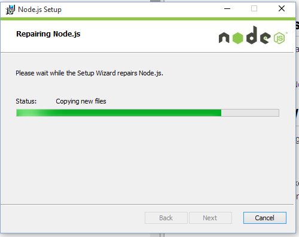

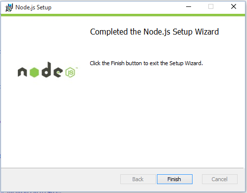

## Install Node Red via Command prompt

Now that Node.js is installed, you can use the Node Package Manager (npm) command to install Node Red from the command prompt.

From the Run menu, type Command. When Command prompt shows in the results, right click and select "Run as Administrator"

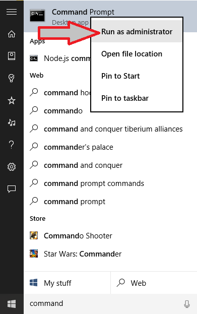

When the command prompt opens, use the following command to install Node Red:

    npm install -g node-red

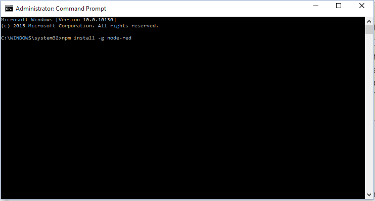

You'll see warning messages scroll past having to do with python -- don't worry, it will not affect your install. When the installation completes, you should see something similar to the screenshot below with various modules that are installed by default.

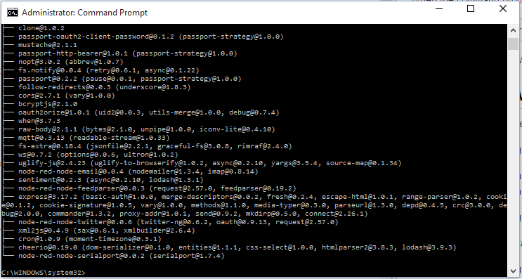

## Running and Stopping Node Red
To run Node Red, simply type `node-red` into your command prompt window. Take note of the data displayed, specifically the `User Directory`, and `Server now running at http://127.0.0.1:1880/` -- to access the Node Red editor, browse to [http://127.0.0.1:1880/](http://127.0.0.1:1880/) 

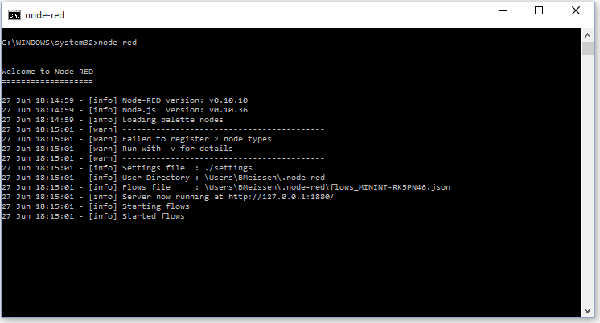

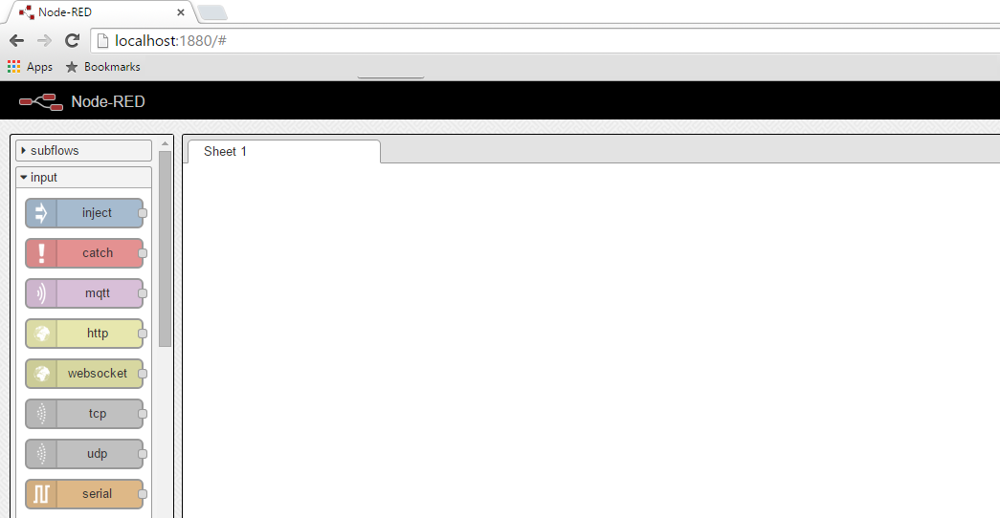

To stop Node Red, use `Control+C` in the command window. Type `Y` to confirm.

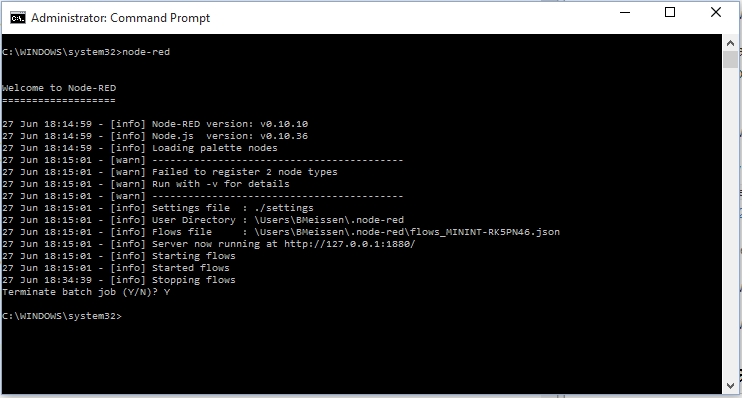

## Add additional nodes to your installation

Additional Node Modules can be added to your default installation to add more functionality. We will walk you through installing Pushbullet and Freeboard by editing the `package.json` file, but [additional modules can be found on Node Red's website](http://flows.nodered.org/). Noteworthy modules which you can install on your own include nodes for interacting with Wemo devices, Hue devices, and Nest thermostats. 
> Note: Any time you run the `npm install` command from the command prompt, make sure you are in your Node Red install folder as described below.

Return to the command prompt window where you used the `node-red` command. As noted earlier, use `Control+C` to stop the application, then `Y` to confirm termination.

  

Open a new window in Windows Explorer and browse to your Node Red installation directory:
>C:\users\\(Your Windows username)\AppData\Roaming\npm\node_modules\node-red\

In the directory, you will see `package.json` - open this file using your favorite text editor. I recommend [notepad++](https://notepad-plus-plus.org/)

In `package.json`, around line 39 will be `"dependencies": {` - add the following lines below the dependencies line:

	"node-red-node-pushbullet":"0.x",
	"node-red-contrib-freeboard":"git://github.com/tfatykhov/node-red-contrib-freeboard.git",

Your dependencies section should now look like this:

	"dependencies": {
	"node-red-node-pushbullet":"0.x",
	"node-red-contrib-freeboard":"git://github.com/tfatykhov/node-red-contrib-freeboard.git",
    "express": "3.17.2",
    "when": "3.7.3",
    "bcryptjs": "2.1.0",
    "nopt": "3.0.2",
    "mqtt": "0.3.x",
    "ws": "0.7.2",
    "fs-extra": "0.18.4",
    "clone": "1.0.2",
    "mustache": "2.1.1",
    "cron": "1.0.9",
    "raw-body": "2.1.1",
    "xml2js": "0.4.9",
    "sentiment": "0.2.3",
    "follow-redirects": "0.0.3",
    "cors": "2.7.1",
    "cheerio": "0.19.0",
    "uglify-js": "2.4.23",
    "on-headers": "1.0.0",
    "is-utf8": "0.2.0",
    "fs.notify": "0.0.4",
    "passport": "0.2.2",
    "passport-http-bearer": "1.0.1",
    "passport-oauth2-client-password": "0.1.2",
    "oauth2orize": "1.0.1",
    "node-red-node-feedparser": "0.0.*",
    "node-red-node-email": "0.0.*",
    "node-red-node-twitter": "0.0.*",
    "node-red-node-serialport": "0.0.*",
    "bcrypt": "0.8.3"
	},

Save the file and return to our command prompt window. Use the `cd` command to change to the Node Red installation directory:

	cd C:\users\(Your Windows username)\AppData\Roaming\npm\node_modules\node-red\

Once in the Node Red install directory, enter the following command to re-compile Node Red:

	npm -l install

If successful, you should have a window similar to this:

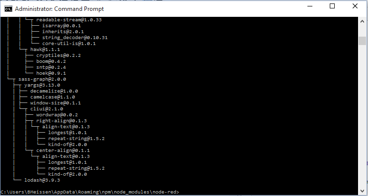

After issuing the `node-red` command to start Node Red up again, you should see two Push Bullet nodes under the Social category:

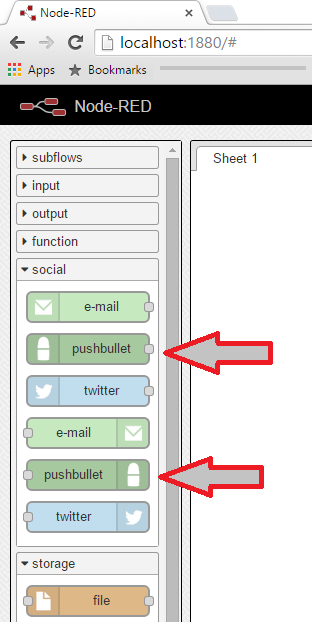

To access your Freeboard module, browse to [http://localhost:1880/freeboard](http://localhost:1880/freeboard)

Next we will make changes to the configuration to secure your Node Red application and also set up some necessary variables for our sample flows to work!

## Configuring Your Application

Open a Windows Explorer window and browse to your Node Red installation folder:
> Note: By default, Node Red is installed to:
> C:\Users\\(Your Username)\AppData\Roaming\npm\node_modules\node-red\
 
For Wink to be able to send you status updates on your devices, your Node Red application must be accessible to the internet. For that reason, we'll want to make sure our Node Red application is secure!

In your Node Red folder, we need to edit the `settings.js` file.

### *OPTIONAL* Port Change 
In `settings.js`, look for this line:

	uiPort: 1880,

This step is completely optional, but if you would like to change the port which Node Red uses, you can change this setting here. If you're not sure, leave the port alone.

### *REQUIRED* Password Protection
In `settings.js`, around line 21 is `module.exports = {` - paste the following beneath this line:

	adminAuth: {
		type: "credentials",
		users: [{
			username: "(Whatever username you want to use to log in to Node Red)",
			password: "(Password  Hash - see below)",
			permissions: "*"
		}]
	},	

Once you've pasted the adminAuth function into the `settings.js` file, we need to generate a password hash to put into the `password` field. 

Hopefully you still have your Command Prompt window open from the previous steps - if so, terminate the Node Red batch job by pressing `Control+C` and `Y` to confirm.

You must be in the Node Red installation folder for the following step to work, so make sure you're in `C:\Users\(Your username)\AppData\Roaming\npm\node_modules\node-red\` and then issue the following command into the Command Prompt window:

    node -e "console.log(require('bcryptjs').hashSync(process.argv[1], 8));" your-password-here

Copy and the hash which is generated from this command and paste it between the quotations in the password field we put in `settings.js`. 

Once completed, adminAuth should look similar to this:

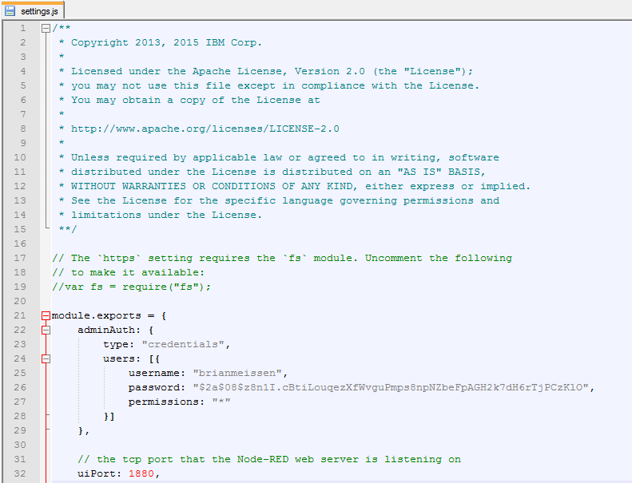

When Node Red is started again, you will be prompted with the following login page to be able to access the editor:

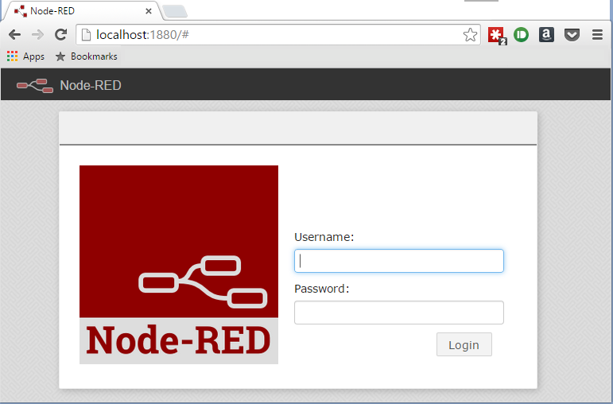

### *REQUIRED* Global Variables for WinkNode Flows
Lastly, still in the `settings.js` file, find

        functionGlobalContext: { },

and replace it with these lines:

        functionGlobalContext: {
              WinkUser         : { uid : "your Wink username"
                                 , pwd : "your Wink password"
                                 }
            , BlueMixUrlBase   : "http://(your *PUBLIC* IP address):(port)/"
            , forecastIoApiKey : "your API key"
            , HomeLocation     : { lon : "the longitude of your home location"
                                 , lat : "the lattitude of your home location"
                                 }
            , FREEBOARD_TOKEN  : "pseudo-random-string"
        },

> Notes: To get an API key for `forecast.io` go [here](https://developer.forecast.io)

> To get your public IP address, [perform a Google search for "IP address"](https://www.google.com/webhp?sourceid=chrome-instant&ion=1&espv=2&ie=UTF-8#q=ip+address) and your IP will be returned in the results.

Save the `settings.js` file, return to your Command Prompt window and start Node Red using `node-red` command. Node Red should start without any errors. 

## Configure port forwarding to make Node Red internet accessible
For the Wink flows to work your Node Red application must be accessible from the internet. This requires setting up a port forwarding rule to route any requests to http://(your public IP):1880/ goes to your computer's Node Red application.

By far the easiest Port Forwarding tutorial ever, use the following link to set up port forwarding for Node Red entirely through Windows. You won't even have to log into your router's web interface at all. I was stunned this works, but it does!

[http://www.tomshardware.com/faq/id-1951258/easily-open-ports-port-forward-router.html](http://www.tomshardware.com/faq/id-1951258/easily-open-ports-port-forward-router.html)

> Note: You must start the Node Red application before Windows Firewall will prompt you to allow the application access to the internet. When the window pops up, click Accept and your Node Red application will now be accessible from the internet. 

## Fundamental Flows for Node Red and Wink Integration
Go to [your Node Red install](http://localhost:1880/)

If you haven't logged in yet, you will be prompted to enter the username and password you set up in the `settings.js` file earlier.

Once in the editor, click on the three bars in the upper-right hand corner to get the menu,
select "Import > Clipboard",
copy the contents of [Flows/Bluemix/Bluemix-Monitoring.json](Flows/Bluemix/Bluemix-Monitoring.json)
into the pop-up window,
and click "OK".

Click on "Deploy". you will see information will start flow in debug window on right side of the screen (may need to switch to debug tab)

To start using Freeboard,
go to [http://localhost:1880/freeboard](http://localhost:1880/freeboard/),
and take a look at [README-Freeboard.md](README-Freeboard.md).
